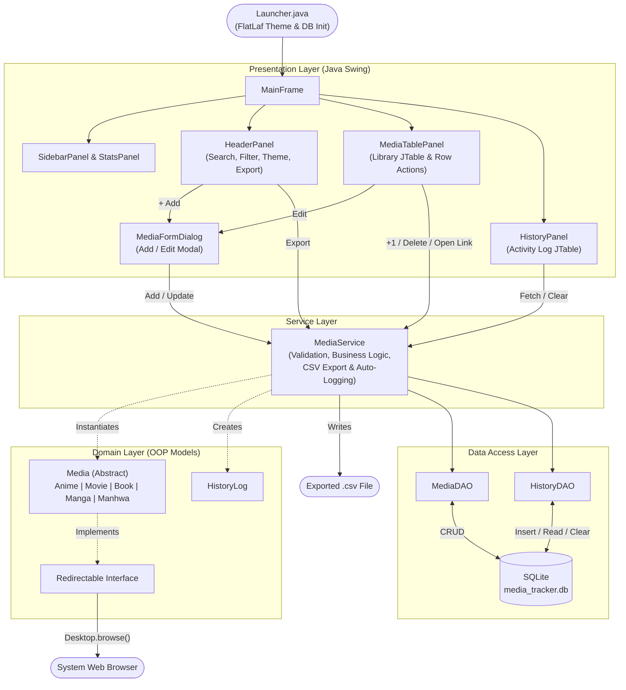

```mermaid
flowchart TD
    Launcher(["Launcher.java<br/>(FlatLaf Theme & DB Init)"]) --> MainFrame

    subgraph UI ["Presentation Layer (Java Swing)"]
        MainFrame["MainFrame"]
        Panels["SidebarPanel & StatsPanel"]
        Header["HeaderPanel<br/>(Search, Filter, Theme, Export)"]
        Table["MediaTablePanel<br/>(Library JTable & Row Actions)"]
        HistoryUI["HistoryPanel<br/>(Activity Log JTable)"]
        Dialog["MediaFormDialog<br/>(Add / Edit Modal)"]

        MainFrame --> Panels
        MainFrame --> Header
        MainFrame --> Table
        MainFrame --> HistoryUI
        Header -->|"+ Add"| Dialog
        Table -->|"Edit"| Dialog
    end

    subgraph Service ["Service Layer"]
        MediaService["MediaService<br/>(Validation, Business Logic,<br/>CSV Export & Auto-Logging)"]
    end

    subgraph Domain ["Domain Layer (OOP Models)"]
        MediaModel["Media (Abstract)<br/>Anime | Movie | Book | Manga | Manhwa"]
        Redirectable["Redirectable Interface"]
        HistoryModel["HistoryLog"]
    end

    subgraph Data ["Data Access Layer"]
        MediaDAO["MediaDAO"]
        HistoryDAO["HistoryDAO"]
        DB[("SQLite<br/>media_tracker.db")]
    end

    Browser(["System Web Browser"])
    CSV(["Exported .csv File"])

    Dialog -->|"Add / Update"| MediaService
    Table -->|"+1 / Delete / Open Link"| MediaService
    Header -->|"Export"| MediaService
    HistoryUI -->|"Fetch / Clear"| MediaService

    MediaService -.->|"Instantiates"| MediaModel
    MediaService -.->|"Creates"| HistoryModel
    MediaService -->|"Writes"| CSV
    MediaService --> MediaDAO
    MediaService --> HistoryDAO

    MediaModel -.->|"Implements"| Redirectable
    Redirectable -->|"Desktop.browse()"| Browser

    MediaDAO <-->|"CRUD"| DB
    HistoryDAO <-->|"Insert / Read / Clear"| DB

```